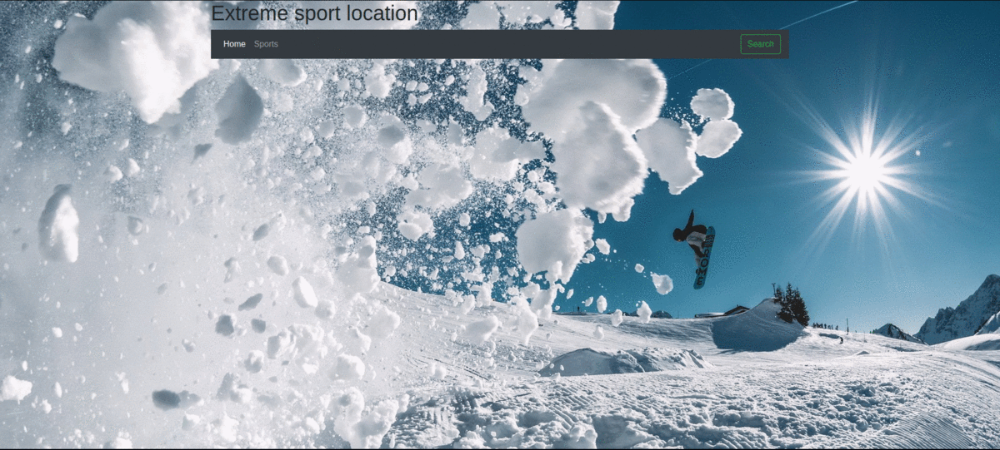

# Extreme Sports Locations

## Описание проекта
Данное приложение разработано для любителей экстремальных видов спорта. Зная вид спорта, которым вы хотите заняться и даты , предполагаемой поездки, приложение подберет оптимальные места отдыха.

## Start 
Для начала произведем установку пакетов:
```bash
npm init
npm install
```

Далее запустим сервер
```bash
npm start 
```
в браузере откроем [домашнюю страницу](http://localhost:3001/)

## Как это выглядит




## Используемые технологии 
 - __Handlebars__
 - __Node.js__ 
 - __Express.js__
 - __MongoDB__ 
 - __Bootstrap__
 - __GoogleMaps API__
 - __Youtube API__ 


